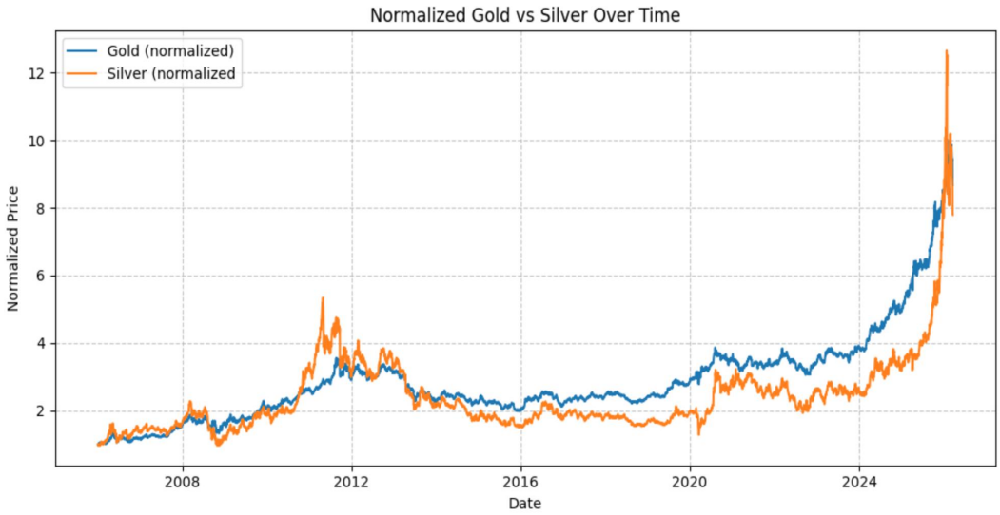
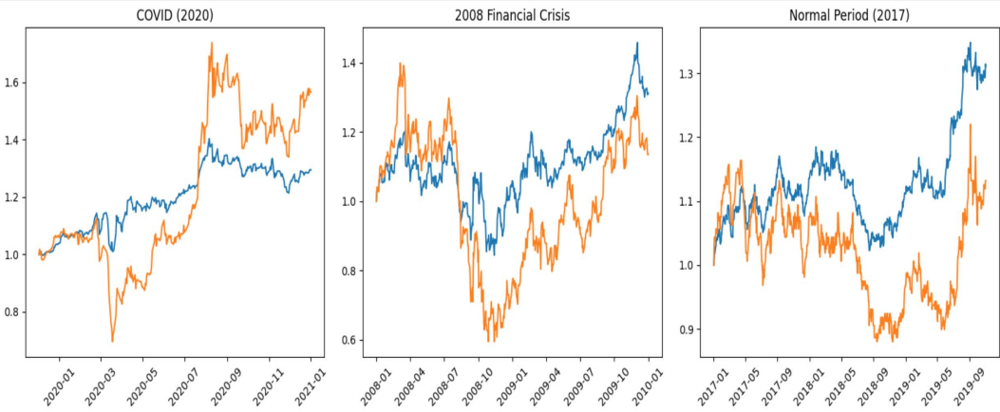
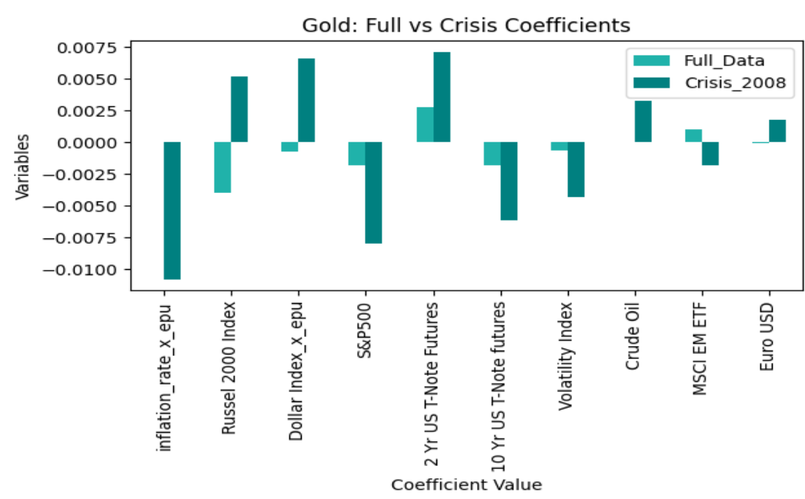
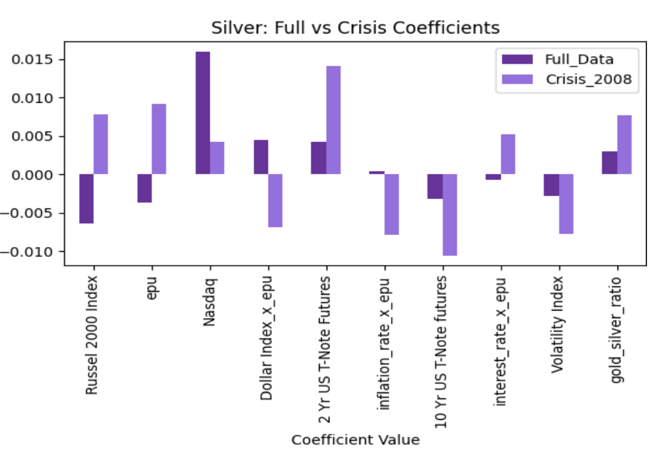
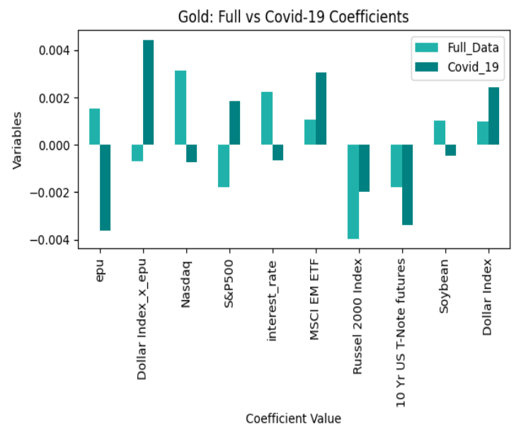
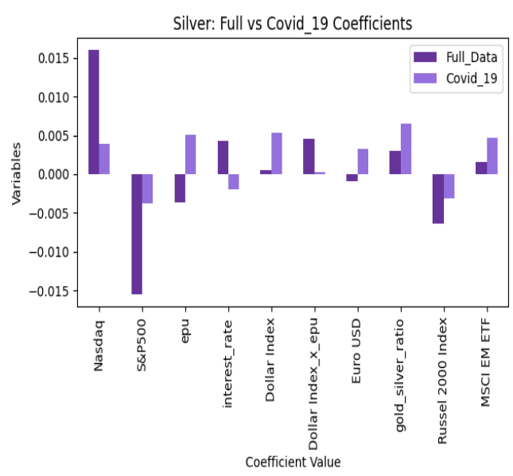

# Macroeconomic Drivers, Market Dynamics, and the Predictability of Gold and Silver Prices Under Economic Uncertainty
## Abstract:
- Gold and silver have long been considered safe-haven assets, particularly during periods of economic instability, inflation, and financial market volatility. Understanding the factors that drive their price movements is important for investors, policymakers, and financial institutions seeking to manage risk and make informed decisions.
- However, despite their significance, there is limited understanding of how macroeconomic variables and economic policy uncertainty jointly influence the predictability of gold and silver price movements in a rapidly changing global financial environment. 
- The main objective of this study is to examine how macroeconomic indicators, market variables, and economic policy uncertainty affect gold and silver price dynamics, and to evaluate whether these factors can be used to predict short-term price movements.  

## Research Question:
> How do macroeconomic and market variables influence gold and silver price movements, and does economic policy uncertainty affect their ability to predict price trends?

## Data Retrieval:

| Source | Description |
|------|------------|
| Yahoo Finance | Daily prices for gold, silver, equities, commodities |
| FRED | Inflation (breakeven), interest rates |
| EPU Index | Daily Economic Policy Uncertainty |

- *Data aligned to business days* 
- *Missing values handled using forward/backward fill*

## Methodology and ML Models
1. **Feature Engineering**: Daily percentage returns were computed for gold and silver using pct_change() and shifted by one day to create next-day return targets. Three interaction terms were constructed by multiplying EPU with inflation rate, interest rate, and the Dollar Index to capture regime conditional macro effects. A binary highuncertainty flag (epu_high) was created by thresholding EPU at its 75th percentile, classifying the top 25% of observations as high-uncertainty periods.
2. **Models**: Three models were trained and compared on a chronological 80/20 train-test split. Linear Regression was trained on standardized features as a baseline. Random Forest used 300 trees with a maximum depth of 8 and minimum 5 samples per leaf. XGBoost used 300 boosting rounds with a learning rate of 0.05 subsampling of 0.8, and column subsampling of 0.8. All models predicted next-day returns for gold and silver separately. Performance was evaluated using MSE, RMSE, MAE, and R2
3. **Crisis Regime Tests**: Two out-of-sample regime experiments were conducted. For the 2008 Financial crisis, models were trained on data through December 2007 and tested on January 2008 to January 2010. For COVID-!9, models were trained on January 2017 to December 2019 and tested on December 2019 to January 2022. Linear regression coefficients were compared across the full dataset and each crisis period to identify structural shifts in macro-variable relationship

## Key Results

### Regime Dependence
- Relationships between variables and gold/silver are **not stable**
- Significant coefficient shifts during:
  - 2008 Financial Crisis
  - Covid-19 Period

### Gold vs Silver
- **Gold:** More stable, behaves as a conditional safe-haven  
- **Silver:** More volatile, reacts strongly to market conditions  

### Role of Uncertainty (EPU)
- EPU alters how macro variables affect prices  
- Interaction terms become significant during crises  

## Visualizations
To understand both price behavior and changing macroeconomic relationships, the analysis is structured into two parts: **price dynamics** and **model-based coefficient changes**.

### Price Dynamics Across Time

- Normalized gold and silver prices over the full period (2006–2026) highlight their overall co-movement and long-term trends.  
- While both assets move together broadly, silver exhibits greater volatility, suggesting differing sensitivities to market conditions.

### Behavior Across Economic Regimes

- Gold and silver are compared across three key periods:  
  - 2008 Financial Crisis  
  - Covid-19 Period  
  - Normal Market Conditions  

- These plots show that:
  - Gold behaves more consistently as a hedge  
  - Silver exhibits sharper fluctuations, especially during crises  

### 🔹 Impact of the 2008 Financial Crisis (Model-Based)

**Gold:**

**Silver:**

- Coefficient comparisons (crisis vs full data) reveal **structural shifts in relationships**.  
- Several variables (e.g., equities, interest rates, and uncertainty interactions) change magnitude or direction, indicating that macroeconomic drivers behave differently under financial stress.

### Impact of Covid-19 (Model-Based)

**Gold:**

**Silver:**

- Similar to the 2008 crisis, Covid introduces **instability in relationships**, though with less extreme shifts.  
- Notably, uncertainty and market variables play a stronger and more inconsistent role, particularly for silver.

## Key Insight
> The predictability of gold and silver prices is not constant but depends on economic conditions, with uncertainty fundamentally altering the relationships between macroeconomic drivers and asset returns.

